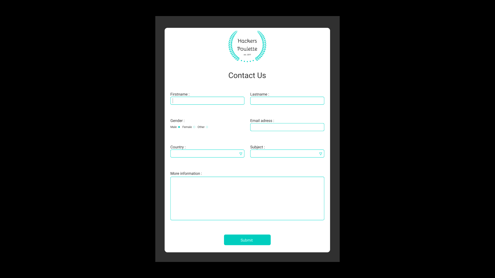

# Hackers-Poulette

Formulary challenge for improve our php skills.

- [WebPage](https://hackerspoulettebros.herokuapp.com/)

- Exercice rules [Hackers-Poulette](https://github.com/becodeorg/BXL-Johnson-4.14/tree/master/06-PHP/hackers_poulette)

## Responsive

The website is responsive and was designed for mobile first.

## Mock-Up

</img>
</img>
</img>

## Built With

- [Bootstrap](https://getbootstrap.com/) - Framework css used
- [HTML](https://www.w3schools.com/html/) - Used for webpage content
- [SCSS](https://www.w3schools.com/sass/) - Used for styling
- [PHP](https://www.php.net/docs.php) - Used for control input from formulary

## Date

- 11 october 2019 (2month at BeCode o/)

## Authors

- **Julien Goetghebuer** - _Initial work_ - [Ggbjulien](https://github.com/ggbjulien)

## Change Logs

- Last Update : 14 october 2019
